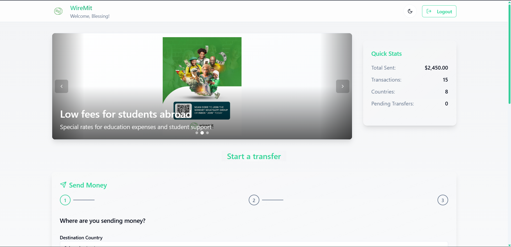
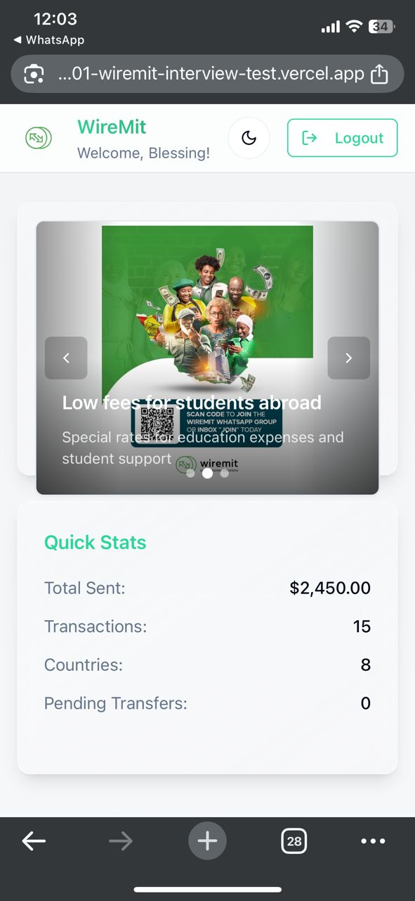

# 💰 wiremit-interview-test

A modern, responsive fintech web application built with React, TypeScript, and Tailwind CSS. Experience seamless money transfers, transaction management, and financial services with an intuitive user interface.

## 🚀 Live Demo

**[View Live Demo] https://nashe01-wiremit-interview-test.vercel.app/**

## 🛠️ Tech Stack


## 🎨 Design & Development Decisions.

### 🌿 Colour Choice: Green Theme

**Primary Color:** `hsl(159 61% 51%)` - A vibrant emerald green

**Why Green?**
- **Trust & Stability**: Green is universally associated with money, growth, and financial security
- **Professional Appeal**: Creates a trustworthy and professional appearance for financial services
- **Accessibility**: High contrast ratios ensure excellent readability for all users
- **Brand Recognition**: Aligns with major financial institutions and fintech companies
- **Psychological Impact**: Promotes feelings of calm, balance, and prosperity


### 🌓 Light & Dark Mode

**Implementation Strategy:**
- **System Preference Detection**: Automatically detects the user's OS theme preference
- **Persistent Storage**: Remembers the user's choice across sessions using localStorage
- **Smooth Transitions**: 300ms CSS transitions for seamless theme switching
- **Accessibility Compliance**: Maintains WCAG contrast ratios in both themes

**Why Both Modes?**
- **User Preference**: 42% of users prefer dark mode for reduced eye strain
- **Battery Efficiency**: Dark mode saves battery on OLED/AMOLED displays
- **Professional Flexibility**: Accommodates different work environments and lighting conditions
- **Modern Standard**: Expected feature in contemporary web applications


### 🔐 Local Storage Authentication

**Implementation Details:**
- **Mock User Management**: Simulates real authentication without backend dependencies
- **Session Persistence**: Users remain logged in across browser sessions
- **Data Validation**: Form validation using Zod schema validation
- **Secure Storage**: Passwords are stored locally for demo purposes

**Why Local Storage for Demo?**
- **Rapid Prototyping**: Enables quick development and testing cycles
- **Offline Capability**: Works without internet connection
- **Demo-Friendly**: Perfect for showcasing UI/UX without backend setup
- **Development Efficiency**: Focus on frontend features rather than authentication infrastructure


### 📱 Strategic Ad Placement

**Multi-Device Advertisement Strategy:**
- **Desktop Banner Design**: Full-width hero banner positioned above the "Send Money" section for maximum visibility and engagement
- **Mobile/Tablet Sidebar**: Compact ad card in the right sidebar area to maintain content hierarchy
- **Non-Intrusive Design**: Ads positioned strategically to avoid interfering with core functionality
- **User Experience Priority**: Main content remains the primary focus across all devices
- **Responsive Layout**: Ads adapt seamlessly between banner and sidebar layouts
- **Performance Optimized**: Lazy loading and efficient rendering with smooth transitions

**Why This Multi-Device Approach?**
- **Desktop Banner**: 
  - **Hero Positioning**: Above-the-fold placement captures immediate attention
  - **Full-Width Impact**: Maximum visual impact for premium advertising space
  - **Content Flow**: Natural progression from ads to action (Send Money)
  - **Revenue Optimization**: Premium banner placement commands higher engagement rates
- **Mobile/Tablet Sidebar**:
  - **Reading Pattern**: Users scan left-to-right, keeping main content in primary viewing area
  - **Space Efficiency**: Compact sidebar placement maximizes content-to-ad ratio
  - **Touch-Friendly**: Optimized for mobile interaction patterns
  - **User Satisfaction**: Maintains clean, uncluttered interface on smaller screens



### 📱 Responsive Design

**Multi-Device Compatibility:**
- **Mobile-First Approach**: Designed for mobile devices first, then enhanced for larger screens
- **Breakpoint Strategy**: Tailwind CSS breakpoints for consistent responsive behaviour
- **Touch-Friendly**: Optimised touch targets and gestures for mobile users
- **Performance Optimised**: Efficient rendering across all device types

**Responsive Features:**
- **Flexible Grid System**: Adapts to different screen sizes automatically
- **Mobile Navigation**: Collapsible sidebar and mobile-optimized menus
- **Touch Gestures**: Swipeable carousels and intuitive mobile interactions
- **Adaptive Typography**: Font sizes that scale appropriately across devices

<div style="display: flex; gap: 20px; justify-content: center; margin: 20px 0;">
  
  
</div>

## 🏗️ Project Structure

```
pocket-sparkle-flow-main/
├── public/                 # Static assets and public files
│   ├── ads/               # Advertisement images (legacy; current carousel uses images from src/assets)
│   ├── logo.png           # Application logo
│   └── placeholder.svg    # Default placeholder image
├── src/                   # Source code directory
│   ├── components/        # Reusable UI components
│   │   ├── ui/           # Shadcn/ui components
│   │   ├── AdsCarousel.tsx  # Supports variant="banner" | "sidebar"
│   │   ├── Navbar.tsx
│   │   ├── SendMoney.tsx
│   │   └── ...           # Other components
│   ├── context/          # React Context providers
│   │   ├── AuthContext.tsx
│   │   ├── RatesContext.tsx
│   │   └── ThemeContext.tsx
│   ├── data/             # Mock data and static content
│   │   ├── ads.json          # Supplies text/subtitles; images come from src/assets/card*.jpg
│   │   ├── fees.json
│   │   └── transactions.json
│   ├── hooks/            # Custom React hooks
│   ├── lib/              # Utility functions and helpers
│   ├── pages/            # Application pages and routes
│   │   ├── Dashboard.tsx
│   │   ├── LandingPage.tsx
│   │   └── NotFound.tsx
│   ├── App.tsx           # Main application component
│   ├── main.tsx          # Application entry point
│   └── index.css         # Global styles and CSS variables
├── package.json           # Dependencies and scripts
├── tailwind.config.ts     # Tailwind CSS configuration
├── tsconfig.json          # TypeScript configuration
└── vite.config.ts         # Vite build configuration
```

## 🚀 Installation & Setup

### Prerequisites

- **Node.js** (v18.0.0 or higher)
- **npm** (v8.0.0 or higher) or **bun** (v1.0.0 or higher)
- **Git** (for cloning the repository)

### Quick Start

1. **Clone the Repository**
   ```bash
   git clone https://github.com/nashe01/nashe01-wiremit_interview_test.git
   cd wiremit_interview_test
   ```

2. **Install Dependencies**
   ```bash
   # Using npm(recommended)
   npm install
   
   # Using bun 
   bun install
   ```

3. **Start Development Server**
   ```bash
   # Using npm
   npm run dev
   
   # Using bun
   bun dev
   ```

4. **Open in Browser**
   Navigate to `http://localhost:` to view the application

### Build for Production

```bash
# Using npm
npm run build

# Using bun
bun run build
```

### Available Scripts

- `dev` - Start development server with hot reload
- `build` - Build for production
- `build:dev` - Build for development
- `preview` - Preview production build locally
- `lint` - Run ESLint for code quality checks


## 🎯 Key Features

- **💰 Money Transfer System**: Multi-step money transfer with validation
- **📊 Transaction History**: Comprehensive transaction tracking and management
- **🎨 Theme Switching**: Light and dark mode with smooth transitions
- **📱 Responsive Design**: Optimized for all device sizes
- **🔐 User Authentication**: Local storage-based user management
- **📈 Real-time Rates**: Dynamic exchange rate calculations
- **🎪 Ad Integration**: Strategic advertisement placement
- **⚡ Performance**: Optimized with Vite and modern React patterns

- **📊 Transaction Management Showcase**


## ✅ Validation & Data Integrity

### 🔐 Form Validation System

**React Hook Form + Zod Schema Validation:**
- **Type Safety**: Full TypeScript integration with Zod schemas
- **Real-time Validation**: Instant feedback as users type
- **Error Handling**: Comprehensive error messages and visual indicators
- **Field Validation**: Individual field validation with custom rules

### 📝 User Registration Validation

**Sign Up Form Validations:**
- **Email Format**: Validates proper email structure and format
- **Password Strength**: Minimum 8 characters with complexity requirements
- **Password Confirmation**: Ensures password and confirm password match
- **Required Fields**: All mandatory fields must be completed
- **Name Validation**: First name and last name are required fields
- **Duplicate Check**: Prevents registration with existing email addresses


### 🔑 User Authentication Validation

**Sign In Form Validations:**
- **Email Verification**: Ensures email exists in the system
- **Password Match**: Validates password against stored credentials
- **Session Management**: Handles login state and persistence
- **Error Feedback**: Clear messages for invalid credentials


### 💰 Money Transfer Validation

**Multi-Step Transfer Process:**
- **Recipient Validation**: Ensures recipient information is complete
- **Amount Validation**: Minimum and maximum transfer limits
- **Currency Validation**: Validates currency codes and exchange rates
- **Fee Calculation**: Dynamic fee calculation based on amount and currency
- **Balance Check**: Verifies sufficient funds for transfer
- **Transaction Confirmation**: Final review before processing


### 📱 Input Field Validations

**Real-time Input Validation:**
- **Phone Number**: International phone number format validation
- **Amount Fields**: Numeric input with decimal precision
- **Currency Selection**: Dropdown validation for supported currencies
- **Date Fields**: Date picker with range validation
- **Required Field Indicators**: Visual cues for mandatory inputs

<div style="display: flex; gap: 20px; justify-content: center; margin: 20px 0;">
  
  
</div>

### 🛡️ Data Security Validations

**Security Measures:**
- **Input Sanitization**: Prevents XSS and injection attacks
- **Data Encryption**: Secure storage of sensitive information
- **Session Validation**: Secure session management
- **Access Control**: Route protection for authenticated users

### 📊 Transaction Data Validation

**Transaction Integrity:**
- **Amount Verification**: Ensures transfer amounts are valid
- **Currency Conversion**: Validates exchange rate calculations
- **Fee Validation**: Confirms fee calculations are accurate
- **Status Tracking**: Monitors transaction state changes
- **Error Handling**: Graceful handling of validation failures

### 🎯 Validation User Experience

**User-Friendly Validation:**
- **Instant Feedback**: Real-time validation messages
- **Visual Indicators**: Color-coded success/error states
- **Progressive Disclosure**: Step-by-step form completion
- **Error Recovery**: Clear guidance for fixing validation issues
- **Accessibility**: Screen reader support for validation messages


## 📄 License

This project is licensed under the MIT License - see the [LICENSE](LICENSE) file for details.

## 🙏 Acknowledgments

- **Shadcn/ui** for beautiful, accessible components
- **Tailwind CSS** for utility-first styling
- **Radix UI** for accessible primitives
- **Framer Motion** for smooth animations
- **Vite** for fast development experience

---

